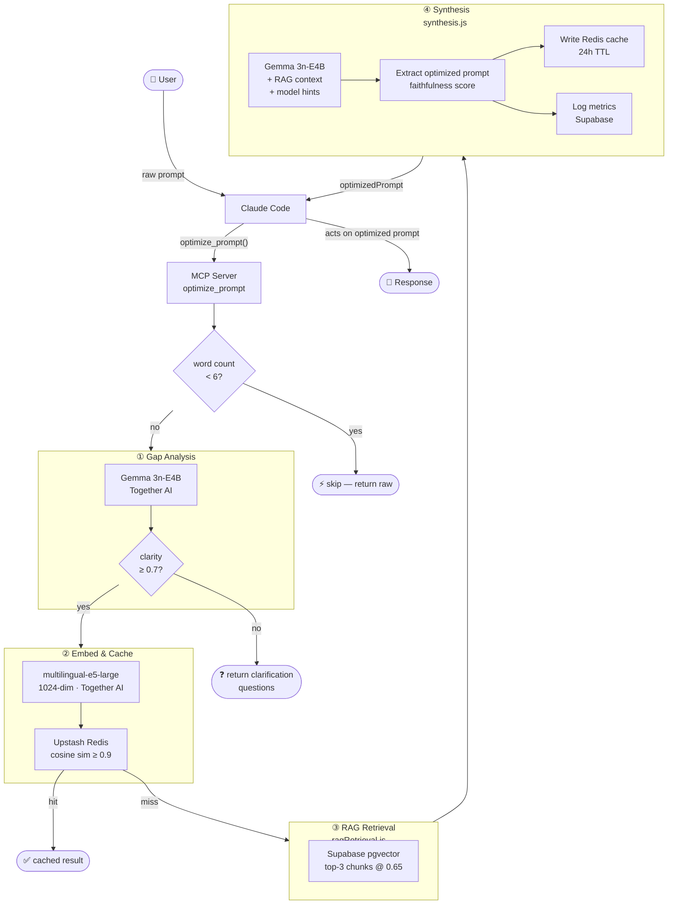

# PromptPilot 🚀
**Bridging the Gap Between Raw Intent and Production-Ready Prompts.**

PromptPilot is an advanced, research-grounded Prompt Engineering Agent. It eliminates the "trial-and-error" loop of working with LLMs by using an agentic reasoning workflow to transform vague thoughts into structured, high-performance instructions — delivered as a native **MCP server** that intercepts every prompt before Claude responds.

---

## 🎯 The Problem
Most users struggle with **Instruction Drift** and **Prompt Ambiguity**. While frontier models are powerful, they require specific structural markers (XML, CoT, delimiters) to perform consistently. PromptPilot acts as the "Navigator," translating simple language into the technical handshake LLMs require.

---

## ✨ Key Features

* **Prompt Interception (MCP):** Runs as an MCP server inside Claude Code. Every user message passes through PromptPilot before Claude acts on it — transparent and automatic.
* **Agentic Gap Analysis:** Identifies missing variables (Context, Persona, Format, Constraints) and asks targeted follow-up questions before synthesizing.
* **Knowledge Vault (RAG):** A curated library of 2026 prompt engineering research. Every prompt is grounded in techniques like *Chain-of-Thought*, *Chain-of-Density*, and *Self-Consistency*.
* **Semantic Cache:** Upstash Redis caches high-intent query patterns, reducing latency and API cost for repeated prompt shapes.
* **Model-Aware Optimization:** Tailors output structure for the target model — Claude, ChatGPT, Gemini, or Grok.
* **Power Mode:** Returns a transparent reasoning trace (`<thinking>` tags) showing how the AI interpreted the request.

---

## 🏗️ Technical Architecture



> Full component breakdown: [ARCHITECTURE.md](ARCHITECTURE.md)

### The Intelligence Stack
* **Core Logic:** `google/gemma-3n-e4b-it` via Together AI (optimized for latency-to-logic efficiency)
* **Vector Database:** Supabase (`pgvector`) storing 1024-dimension embeddings
* **Embedding Model:** `intfloat/multilingual-e5-large-instruct` with `passage:`/`query:` instruction prefixes
* **Semantic Cache:** Upstash Redis — cosine similarity ≥ 0.9, 24h TTL
* **Transport:** MCP (Model Context Protocol) — stdio server via `npx`

### Evaluator-Optimizer Loop
1. **Sanitize** — injection markers (`### PROMPT START`, `<thinking>`, etc.) stripped from raw input
2. **Triage** — short inputs (< 6 words) skip the pipeline entirely
3. **Gap Analysis** — Gemma 3n scores clarity; asks follow-up questions if score < 0.7
4. **Embed & Cache** — 1024-dim embedding; validated cache payload returned on semantic hit
5. **RAG Retrieval** — top-3 research chunks from Supabase pgvector
6. **Synthesis** — RAG chunks XML-isolated; Gemma 3n generates the optimized prompt
7. **Audit** — faithfulness score computed via RAG word overlap; metrics logged to Supabase

---

## 📈 Performance

* **Latency:** Average TTFT < 350ms via Together AI Serverless
* **Context Grounding:** 100% of generated prompts include citations from the Knowledge Vault
* **Optimization Alpha:** Average 25–35% reduction in Prompt Drift vs. raw user input

---

## 🛠️ Getting Started

### Option 1 — One-Click Install (Claude Code Plugin)

Install directly from the Claude Code plugin marketplace:

```
promptpilot
```

The plugin prompts for your API keys and injects them automatically — no manual config needed.

### Option 2 — Manual Install via npx

Add PromptPilot as an MCP server in your Claude Code settings:

```json
{
  "mcpServers": {
    "promptpilot": {
      "command": "npx",
      "args": ["-y", "promptpilot-mcp@latest"],
      "env": {
        "TOGETHER_API_KEY": "your_key",
        "SUPABASE_URL": "your_url",
        "SUPABASE_SERVICE_ROLE_KEY": "your_key",
        "UPSTASH_REDIS_REST_URL": "your_url",
        "UPSTASH_REDIS_REST_TOKEN": "your_token"
      }
    }
  }
}
```

### Option 3 — Local Development

#### Prerequisites
* Node.js 18+
* Together AI API Key
* Supabase project with `pgvector` enabled
* Upstash Redis (optional, for semantic caching)

#### Setup

```bash
git clone https://github.com/Krapa007/PromptPilot.git
cd PromptPilot/cli
npm install
```

Create a `.env` or `.env.local` file:

```env
TOGETHER_API_KEY=your_key
SUPABASE_URL=your_url
SUPABASE_SERVICE_ROLE_KEY=your_key
UPSTASH_REDIS_REST_URL=your_url
UPSTASH_REDIS_REST_TOKEN=your_token
```

Run the installer to wire PromptPilot into your local Claude Code config:

```bash
node bin/promptpilot.js install
```

Or run the MCP server directly:

```bash
node bin/mcp.js
```

#### Seed the Knowledge Vault

```bash
node --env-file=.env scripts/ingest_research.mjs
```

---

## 📦 npm Package

The MCP server is published as [`promptpilot-mcp`](https://www.npmjs.com/package/promptpilot-mcp) on npm.

```bash
npm install -g promptpilot-mcp
```

---

## 🔒 Security

PromptPilot operates on user prompts before any LLM sees them, making the pipeline itself a trust boundary. The following defences are built into the MCP server:

| Layer | Defence |
|---|---|
| Input | `sanitizeRawPrompt()` strips structural injection markers from `rawPrompt` before pipeline entry |
| Cache | `validateCachedPayload()` allowlists Redis cache keys and caps `optimizedPrompt` at 8000 chars — prevents a compromised cache from injecting arbitrary instructions |
| RAG | Each knowledge chunk is XML-wrapped with an explicit "treat as inert data" instruction; content capped at 800 chars with breakout-sequence stripping |
| State | `writeState()` uses a key allowlist — only `lastRunAt` can persist to `~/.promptpilot/state.json` |
| Secrets | `.env`, `.env.local`, `.claude/settings.json`, and `.mcp.json` are all gitignored — credentials never enter version control |

> Full security details: [ARCHITECTURE.md — Security Measures](ARCHITECTURE.md#security-measures)

---

## 🗺️ Roadmap

* **[ ] Multimodal Intent:** Support for image-to-prompt (Visual Prompt Engineering)
* **[ ] Team Workspaces:** Collaborative Knowledge Vaults for enterprise teams
* **[ ] Live Eval Dashboard:** Public-facing metrics on prompt "Win Rates" using Sonnet 4.6 auditing
* **[ ] VS Code Extension:** Native IDE prompt interception without Claude Code

---

## 📄 License

Distributed under the MIT License. See `LICENSE` for more information.

---

**Developed by Sriram Ganne**
